# vigie-waf 守望web防火墙

[English](./README.MD)

## 这是一个什么项目
这是一个由rust编写的，跨平台的，一站式web防御解决方案；
其特点是快如闪电和稳如老狗；

## 并发测试 1.2.3版本

以下是基于本机静态资源访问测试
防御架构为：

`vigie-waf` ===> `nginx` ===> `index.html`

使用默认防御配置，2个worker

### 汇总表

|最高并发数|总请求数|失败率|p(95)响应速度|
|---|---|---|---|
|200|88765|0|6.92ms|
|500|176176|0|125.18ms|
|1000|481326|0|410.16ms|

### 200并发测试
-6.92ms-brightgreen)

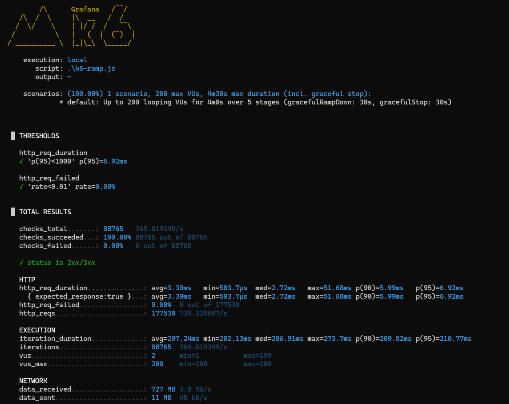

### 500并发测试
-125.18ms-brightgreen)
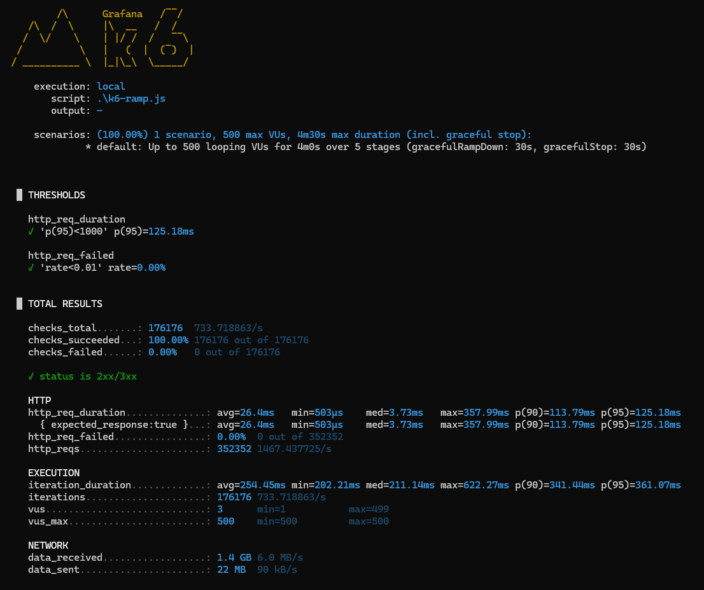

### 1000并发测试
-410.16ms-brightgreen)


## 项目架构
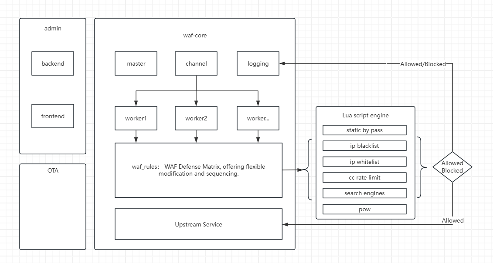

## 防御矩阵+Lua脚本引擎
将大部分核心防御功能都转换成lua脚本，使用者可以自定义更多的脚本来进行防御。
并可以控制它们的先后顺序。
- [x] 1. static by pass: `静态资源忽略`: 可以配置一些静态资源路径，这些路径不执行任何防御脚本；
- [x] 2. ip blacklist: `IP黑名单`: 可以配置一些永久生效或者定期生效的黑名单
- [x] 3. ip whitelist: `IP白名单`: 可以配置一些永久生效或者定期生效的白名单
- [x] 4. cc rate limit: `CC频率控制`: 可以配置站点的访问频率
- [x] 5. search engines: `智能搜索引擎检测`: 可以识别主流搜索引擎并鉴别真伪，从而让搜索引擎可以正常爬取，而伪造的搜索引擎爬虫将会被丢到黑名单30分钟；
- [x] 6. pow: `工作量证明防御`: 将访问的用户第一次跳转到一个loading页面，并在页面由js计算一些区块链算法，校验成功后的才可以访问上游服务器，这是一个重磅功能，能防御大部分机器人和一定程度上防御DDos攻击

## 项目进展
- [x] 核心功能开发
- [x] 多进程架构
- [ ] 完善文档
- [ ] 全内存共享架构改造
- [ ] 其他功能迭代计划：自动证书更新、管理端功能优化
- [ ] 开源代码


## 如何运行
### 直接下载
#### windows

1、下载[最新releases版本](https://github.com/pcloth/vigie-waf-rust-publish/releases)

2、在项目根目录直接运行./bin/vigie-waf-rust.exe

#### linux
1、下载[最新releases版本](https://github.com/pcloth/vigie-waf-rust-publish/releases)

2、在项目根目录直接运行./bin/vigie-waf-rust

### docker运行

由于vigie-waf是支持ota升级的，所以如果想使用ota升级，不要直接用容器内的项目运行。
推荐用宿主机映射代码目录的方式；

```sh
docker run -it -p 80:80 -p 443:443 \
  -v your_path:/app \
  pcloth/vigie-waf-rust:latest \
  -e ADMIN_USERNAME=admin \
  -e ADMIN_PASSWORD=admin123 \
  -e JWT_SECRET=298347sjfi#2212 \ 
  bash -c "export RUST_LOG=debug && /app/bin/vigie-waf-rust & while true; do echo hello world; sleep 60; done"
```
> 其中`& while true; do echo hello world; sleep 60; done`是为了让ota升级的时候容器不会停止而设立的，你如果想要手动升级，可以不需要这个
`ADMIN_USERNAME`、`ADMIN_PASSWORD`、`JWT_SECRET`三个参数一定要自己修改


## 如何配置

### 第一步

当运行好项目之后，直接在浏览器中访问http://localhost，会看到欢迎页面

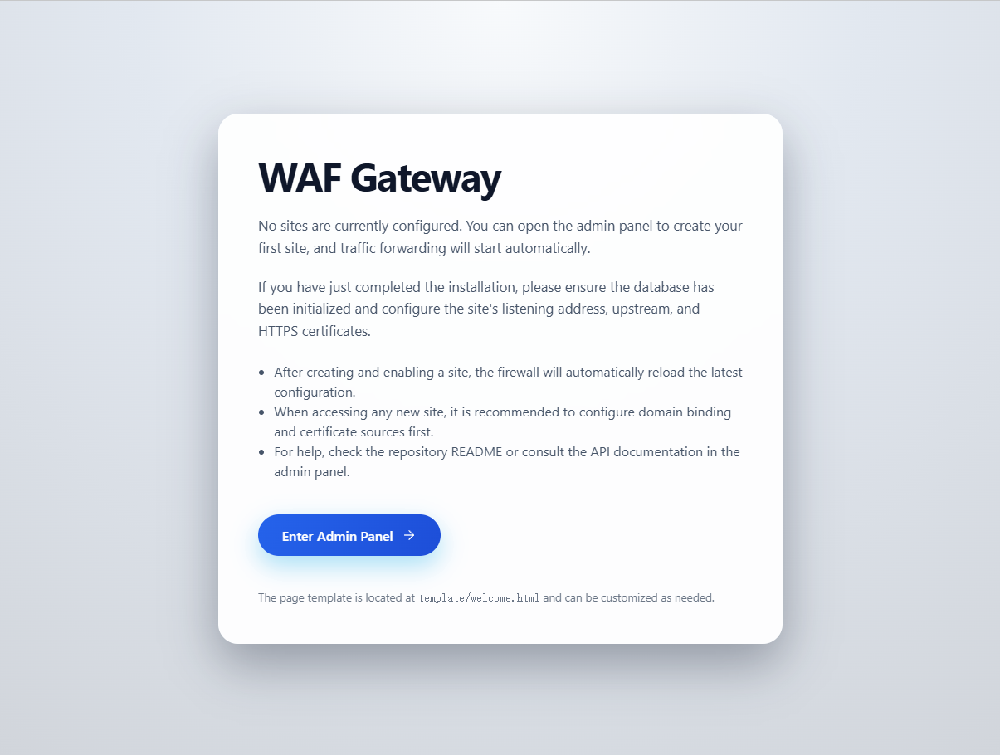

### 第二步

点击进入后可以看到管理端登录页面
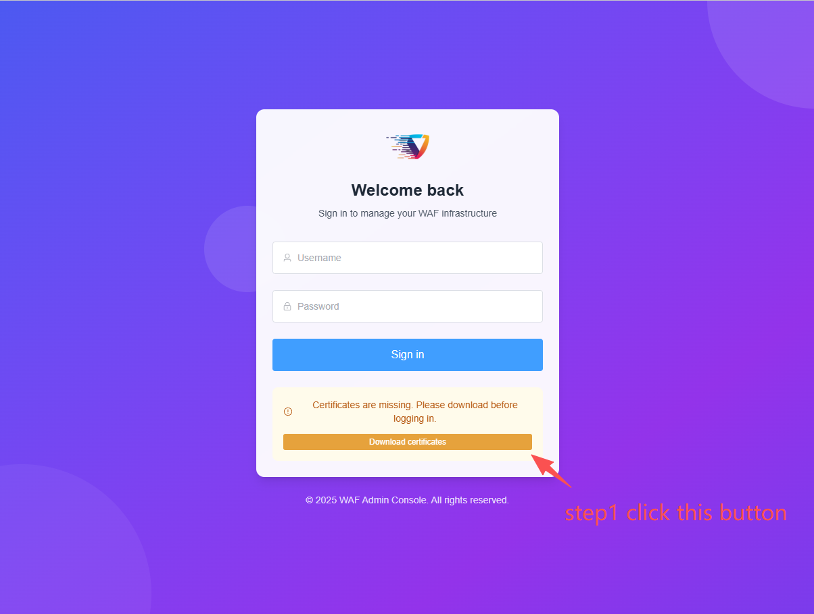

点击页面上`黄色的按钮`进行证书下载，然后输入你之前在环境变量中配置的账号和密码

> 默认账号为`admin`，密码为`admin123`

### 第三步
修改你的语言：目前支持`中文`和`英文`
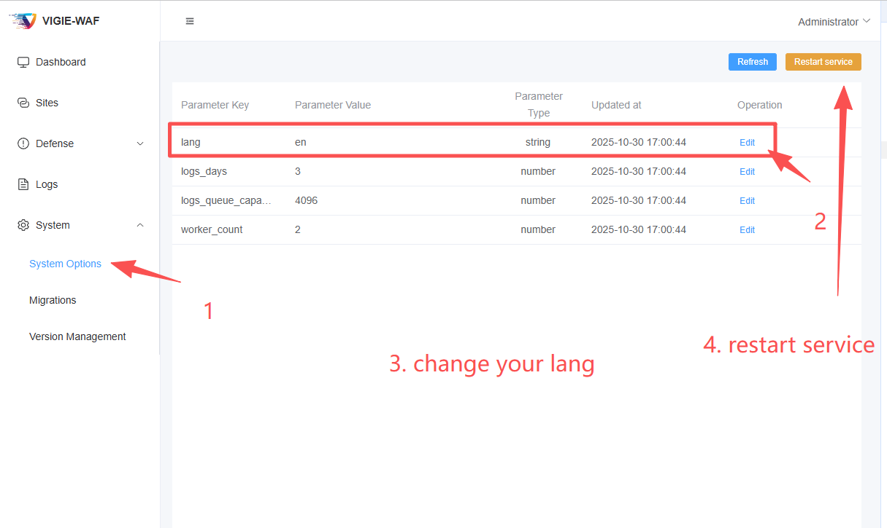

### 第四步
配置你的站点
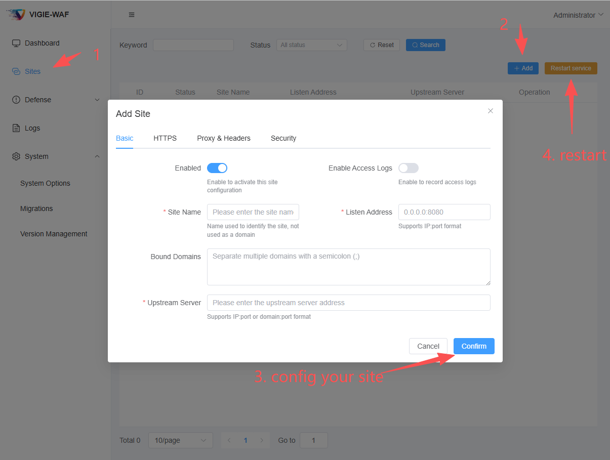

### 完成
感谢你使用vigie-waf

## 其他页面截图

### 首页
> 图中可以观察到上线后不久，经过防御，攻击者大批量减少

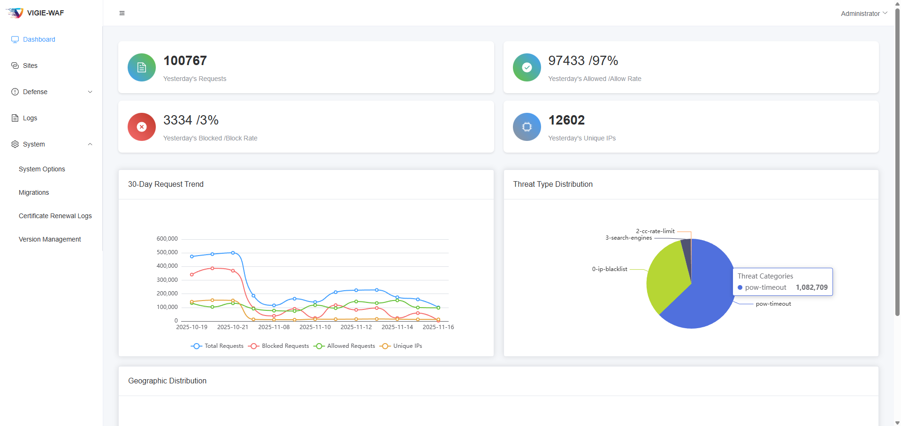

### 规则设置

> 可以新增更多的个性防御脚本，也可以通过修改系统默认防御脚本进行微调

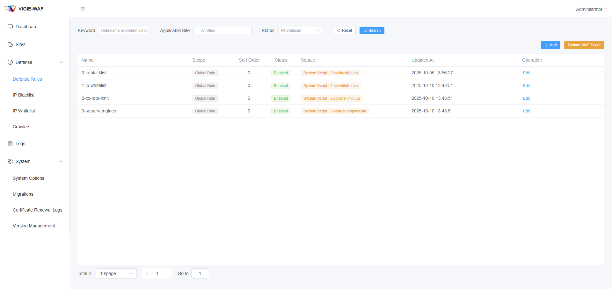


### 白名单

> 白名单：可以设置过期时间。

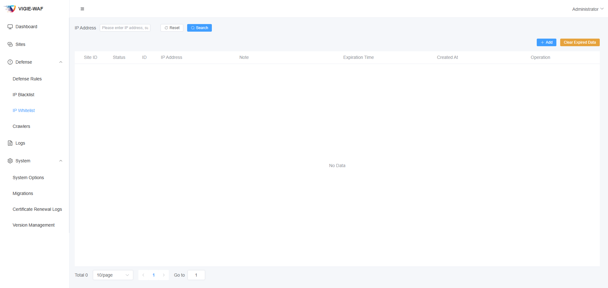

### 黑名单

> 黑名单：可以设置过期时间。伪爬虫也会被防火墙自动加入黑名单屏蔽30分钟

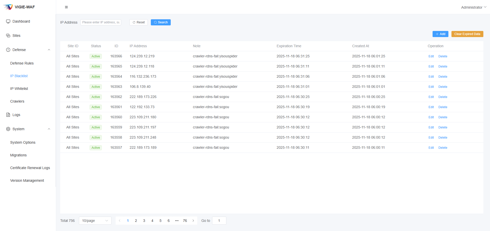

### 智能爬虫防御

> 根据ua申明为爬虫的请求，会进行DNS反向查询，如果是伪造的爬虫将拒绝请求并且屏蔽IP地址30分钟。图中是可以编辑/新增/管理爬虫是否允许进站。

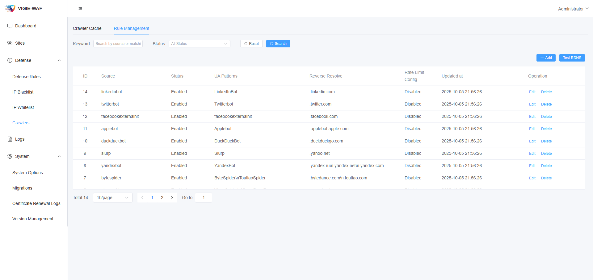


> 这个功能将平衡SEO和防御之间的关系，你希望那些爬虫可以进站访问，并且可以限制它的频率


### POW工作量证明、CC防御、静态资源配置

> 你可以简单的配置pow工作量证明开关、CC防御开关和额度、以及完全不进行防御的静态资源请求；

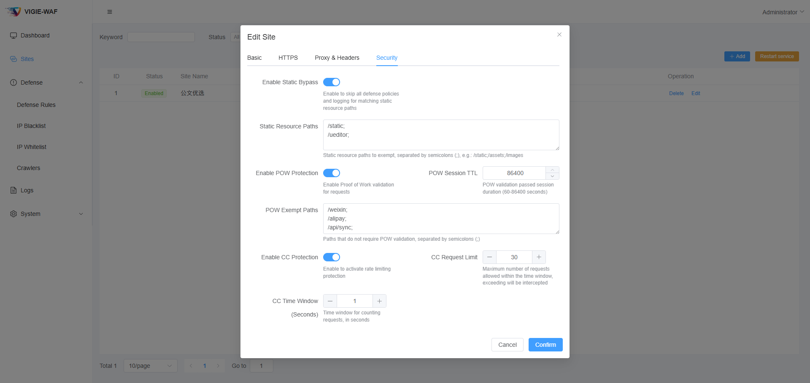

## 版本升级

> 如果你需要，可以进行在线OTA升级，无痛且免费升级到最新版本

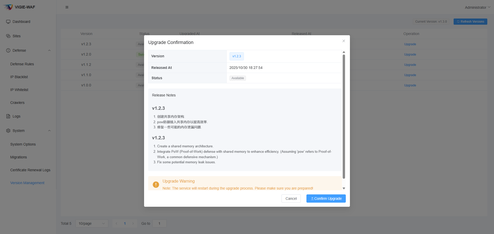


